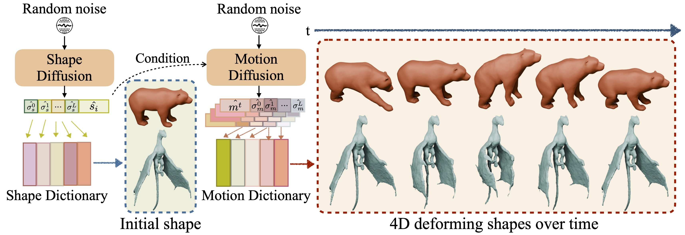

# DNF: Unconditional 4D Generation with Dictionary-based Neural Fields

### [Project Page](https://xzhang-t.github.io/project/DNF/) | [ArXiv](https://arxiv.org/abs/2412.05161) | [Video](https://www.youtube.com/watch?v=l1UhJmTbKIo)
<br />

> DNF: Unconditional 4D Generation with Dictionary-based Neural Fields <br />
> [Xinyi Zhang](https://xzhang-t.github.io/), [Naiqi Li](https://naiqili.github.io/), [Angela Dai](https://www.3dunderstanding.org/team.html)

<p align="center">
    
</p>


#### Citation
    @article{zhang2024dnf,
            title={DNF: Unconditional 4D Generation with Dictionary-based Neural Fields},
            author={Zhang, Xinyi and Li, Naiqi and Dai, Angela},
            journal={arXiv preprint arXiv:2412.05161},
            year={2024}
            }


## Install

#### Build from source
A linux system with cuda is required for the project.

The [dnf_env.yaml](./DNF/dnf_env.yaml) file contains (hopefully) all necessary python dependencies for the project.
To conveniently install them automatically with [anaconda](https://www.anaconda.com/) you can use:

```
conda env create -f dnf_env.yaml
conda activate dnf
```

## Data Preparation
We use DeformingThings4D(DT4D) dataset in this work, download the [dataset](https://github.com/rabbityl/DeformingThings4D). 

##### Normalized data
Normalize the mesh sequences with the first frame.
```
python ./data_processing/normalize_4d.py
```

##### SDF samples
Generate SDF samples around our identities in their t-pose in order to train the shape latent space. 
```
python ./data_processing/sample_sdf.py
```

##### Flow samples
Generate correspondences from an identity in its t-pose to its posed instances. 
For the default setting, we sample 100,000 points on the object surface and 100,000 near surface points.
```
python ./data_processing/sample_flow.py -sigma 0.05
```

## Training an NPM

#### Shape Latent Space

Set `only_shape=True` in [config_train_DT4D.py](./DNF/configs_train/config_train_DT4D.py) and start the training:

```
python train.py
```

#### Pose Latent Space

Set `only_shape=False` in [config_train_DT4D.py](./DNF/configs_train/config_train_DT4D.py). We now need to load the best checkpoint from training the shape MLP. For that, go to [config_train_DT4D.py](./DNF/configs_train/config_train_DT4D.py), make sure `init_from = True` in its first appearance in the file, and then set this same variable to your pretrained model name later in the file:

```
init_from = "<model_name>"
checkpoint = <the_epoch_number_you_want_to_load>
```

Then start the training:

```
python train.py
```

After we have the latent spaces of shape and pose we could fine-tune the MLP on each object to get higher fidelity.

#### Fine-tune the Shape MLP
Set `only_shape=True` and `shape_ft=True` in [config_train_DT4D.py](./DNF/configs_train/config_train_DT4D.py). Load the pre-trained shape MLP and start the fine-tuning:

```
python train.py
```

#### Fine-tune the Pose MLP
Set `only_shape=False` and `pose_ft=True` in [config_train_DT4D.py](./DNF/configs_train/config_train_DT4D.py). Load the pre-trained pose MLP and start the fine-tuning:

```
python train.py
```

Once we reach convergence, you're done. You get the dictionary-based representation of shape and pose that you can use to train the diffusion model.

#### Train the Shape Diffusion 
Set `only_shape=True` in [config_train_Latent.py](./DNF/configs_train/config_train_Latent.py) and start the training of shape diffusion:

```
python train_diff.py
```

#### Train the Pose Diffusion 
Set `only_shape=False` in [config_train_Latent.py](./DNF/configs_train/config_train_Latent.py). You could also enable data augmentation with `reverse=True` or `cond_jitter=True`. Conditioned on the shape latent, train the motion diffusion model:

```
python train_diff.py
```

#### Generate the 4d motion
Load all the best checkpoints from training in both [config_eval_shape.py](./DNF/configs_eval/config_eval_shape.py) and [config_eval_pose.py](./DNF/configs_eval/config_eval_pose.py). Start inference with:

```
python test_diff.py
```

## Pretrained Models
Coming soon! (in next week)

